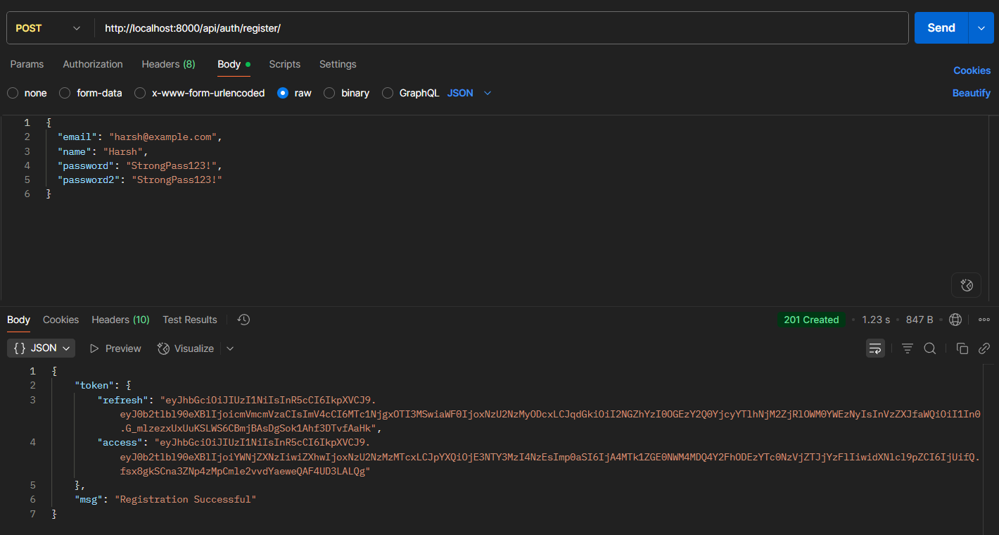

# Healthcare-Backend
- Basic Django framework project stucture
- Django rest framework for restapi
- jwt tokens for auth
- validations
- .env

## Project Setup
```
git clone https://github.com/harshrathore2303/Healthcare-Backend.git
cd Healthcare-Backend
python -m venv .venv
source venv/bin/activate
pip install -r requirements.txt
```
After this create a database in pgadmin then update .env file which is give below and run 
```
python manage.py migrate
python manage.py createsuperuser <!-- This is to create admin so remember credentials to see updates from web browser -->
python manage.py runserver
```

* .env should be in ./healthcarebackend
```
SECRET_KEY=yoursecretkey
DB_NAME=database_name
DB_USER=database_user
DB_PASSWORD=database_pw
DB_HOST=localhost <!-- for my local machine  -->
DB_PORT=5432  <!-- port number according to your database or pgadmin -->
```

## Working Images





